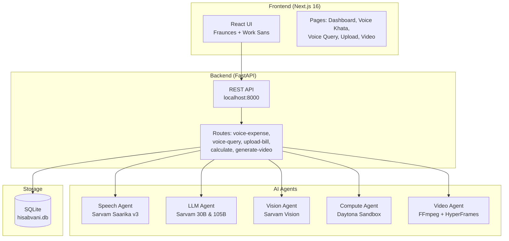
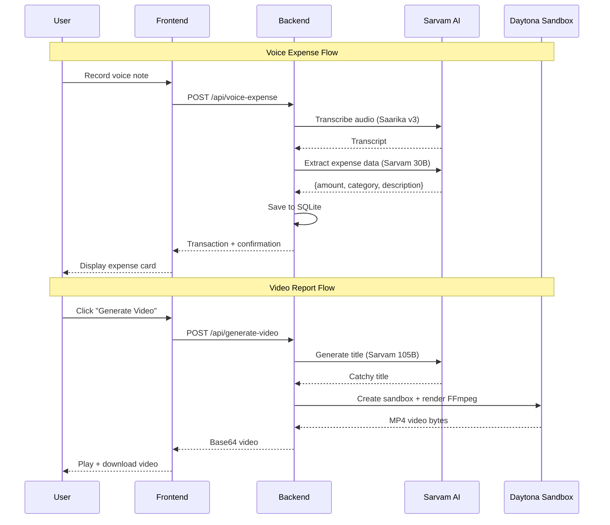

# HisabVani - Voice + Vision Family Finance Agent

A multilingual family finance management system built for Indian households. Record expenses by speaking in Hindi, Hinglish, Kannada, or Tamil. Upload bills and receipts for automatic data extraction. Generate shareable video reports. Powered by Sarvam AI's Indian language models.

## Features

### Voice Khata (Voice Expense Journal)
Record quick voice notes like *"Aaj chai pe 50 rupaye kharcha kiye"* and the system automatically extracts amount, category, and description.

### Voice Query
Ask questions about your finances in natural language. Get responses in the same language you spoke.

### Bill Upload
Upload receipts and bills. Sarvam Vision extracts transaction details automatically.

### Video Reports
Generate shareable MP4 video reports of your expenses using HyperFrames + FFmpeg in Daytona sandboxes.

### Calculator
Execute Python code in isolated Daytona sandboxes for complex financial calculations.

## System Architecture



## User Flow



## Tech Stack

| Layer | Technology |
|-------|-----------|
| Frontend | Next.js 16, React 19, TypeScript, Tailwind v4, Framer Motion |
| Backend | FastAPI, Python 3.13, SQLite |
| Speech-to-Text | Sarvam Saarika v3 (Hindi, Hinglish, Kannada, Tamil, English) |
| Text-to-Speech | Sarvam Bulbul v3 |
| LLM | Sarvam 30B (fast), Sarvam 105B (reasoning) |
| Vision | Sarvam Vision (document digitization) |
| Code Execution | Daytona Sandbox (isolated Python) |
| Video Generation | FFmpeg + HyperFrames (in Daytona sandbox) |
| Package Manager | uv (Python), npm (Node.js) |

## Project Structure

```
hisabvani/
├── backend/
│   ├── agents/
│   │   ├── speech_agent.py      # Sarvam STT/TTS
│   │   ├── llm_agent.py         # Sarvam 30B/105B
│   │   ├── vision_agent.py      # Sarvam Vision
│   │   ├── compute_agent.py     # Daytona sandbox
│   │   └── video_agent.py       # FFmpeg video rendering
│   ├── models/
│   │   └── database.py          # SQLite models
│   ├── routes.py                # Voice query endpoint
│   ├── routes_bills.py          # Bill upload endpoint
│   ├── routes_compute.py        # Calculator endpoint
│   ├── routes_voice_expense.py  # Voice expense endpoint
│   ├── routes_video.py          # Video generation endpoint
│   └── main.py                  # FastAPI app
├── frontend/
│   └── app/
│       ├── page.tsx             # Dashboard
│       ├── expense/page.tsx     # Voice Khata
│       ├── voice/page.tsx       # Voice Query
│       ├── upload/page.tsx      # Bill Upload
│       └── video/page.tsx       # Video Reports
├── tests/                       # Backend tests
├── .env.example                 # Environment template
├── pyproject.toml               # Python dependencies
└── README.md
```

## Setup

### Prerequisites

- Python 3.13+
- Node.js 22+
- [uv](https://docs.astral.sh/uv/) package manager
- Sarvam AI API key ([get one free](https://dashboard.sarvam.ai/))
- Daytona API key ([get one](https://app.daytona.io/))

### Installation

```bash
# Clone the repository
git clone https://github.com/perfect7613/hisabvani.git
cd hisabvani

# Install Python dependencies
uv sync

# Install frontend dependencies
cd frontend
npm install
cd ..

# Configure environment
cp .env.example .env
# Edit .env and add your API keys
```

### Running

```bash
# Terminal 1: Start backend
uv run uvicorn backend.main:app --host 127.0.0.1 --port 8000 --reload

# Terminal 2: Start frontend
cd frontend
npm run dev
```

Open http://localhost:3000 in your browser.

## API Endpoints

| Method | Endpoint | Description |
|--------|----------|-------------|
| GET | `/health` | Health check |
| POST | `/api/voice-expense` | Record voice expense |
| POST | `/api/voice-query` | Ask a question via voice |
| POST | `/api/upload-bill` | Upload bill/receipt image |
| POST | `/api/calculate` | Execute Python code |
| GET | `/api/sample-data` | Get all transactions |
| POST | `/api/generate-video` | Generate expense video |
| GET | `/api/download-video/{id}` | Download video for transaction |

## Testing

```bash
# Run backend tests
uv run pytest tests/ -v

# Build frontend
cd frontend && npm run build
```

## Sarvam AI Models Used

- **Saarika v3** — Speech-to-text with code-mix support (Hindi + English)
- **Bulbul v3** — Text-to-speech with 30+ Indian voices
- **Sarvam 30B** — Fast LLM for expense extraction and chat
- **Sarvam 105B** — Flagship MoE model for video title generation
- **Sarvam Vision** — Document digitization for bill/receipt OCR

## License

MIT
