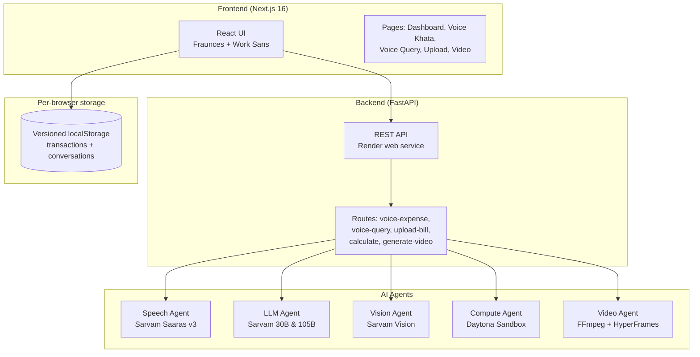
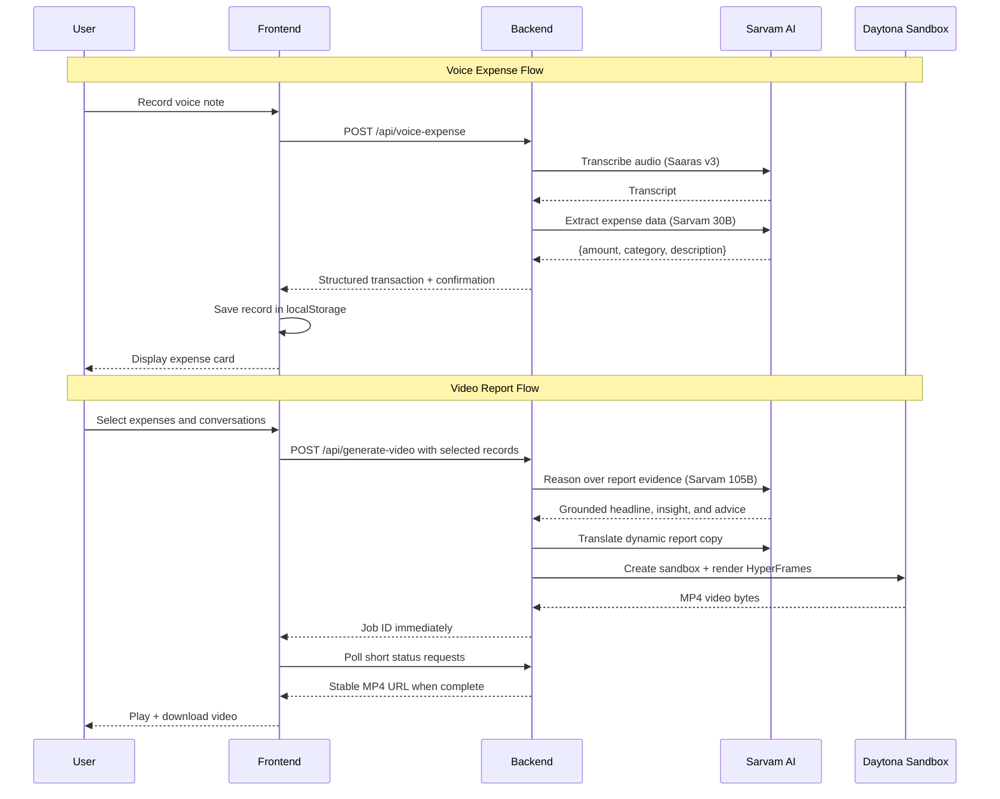

# HisabVani - Voice + Vision Family Finance Agent

A multilingual family finance management system built for Indian households. Record expenses by speaking in Hindi, Hinglish, Kannada, or Tamil. Upload bills and receipts for automatic data extraction. Generate shareable video reports. Powered by Sarvam AI's Indian language models.

## Features

### Voice Khata (Voice Expense Journal)
Record quick voice notes like *"Aaj chai pe 50 rupaye kharcha kiye"* and the system automatically extracts amount, category, and description.

### Voice Query
Ask questions about the expenses saved in the current browser. Sarvam 105B uses
high reasoning effort, stays grounded in the supplied ledger, and answers in
the same language you spoke.

### Bill Upload
Upload receipts and bills. Sarvam Vision extracts transaction details automatically.

### Video Reports
Select multiple voice entries, scanned bills, and saved finance conversations.
Sarvam 105B creates a grounded household briefing, Sarvam Translate localizes
it, and HyperFrames renders a four-scene MP4 with HeyGen catalog audio.

### Calculator
Execute Python code in isolated Daytona sandboxes for complex financial calculations.

## System Architecture



## User Flow



## Tech Stack

| Layer | Technology |
|-------|-----------|
| Frontend | Next.js 16, React 19, TypeScript, Tailwind v4, Framer Motion |
| Backend | FastAPI, Python 3.13 |
| Browser Storage | Versioned localStorage ledger |
| Speech-to-Text | Sarvam Saaras v3 (Hindi, Hinglish, Kannada, Tamil, English) |
| LLM | Sarvam 30B (fast), Sarvam 105B (reasoning) |
| Vision | Sarvam Vision (document digitization) |
| Code Execution | Daytona Sandbox (isolated Python) |
| Video Generation | FFmpeg + HyperFrames (in Daytona sandbox) |
| Package Manager | uv (Python), npm (Node.js) |

## Project Structure

```
hisabvani/
├── backend/
│   ├── agents/
│   │   ├── speech_agent.py      # Sarvam STT
│   │   ├── llm_agent.py         # Sarvam 30B/105B
│   │   ├── vision_agent.py      # Sarvam Vision
│   │   ├── compute_agent.py     # Daytona sandbox
│   │   └── video_agent.py       # FFmpeg video rendering
│   ├── routes.py                # Voice query endpoint
│   ├── routes_bills.py          # Bill upload endpoint
│   ├── routes_compute.py        # Calculator endpoint
│   ├── routes_voice_expense.py  # Voice expense endpoint
│   ├── routes_video.py          # Video generation endpoint
│   └── main.py                  # FastAPI app
├── frontend/
│   ├── lib/
│   │   └── household-ledger.ts  # Browser-local user ledger
│   └── app/
│       ├── page.tsx             # Dashboard
│       ├── expense/page.tsx     # Voice Khata
│       ├── voice/page.tsx       # Voice Query
│       ├── upload/page.tsx      # Bill Upload
│       └── video/page.tsx       # Video Reports
├── tests/                       # Backend tests
├── .env.example                 # Environment template
├── pyproject.toml               # Python dependencies
└── README.md
```

## Setup

### Prerequisites

- Python 3.13+
- Node.js 22+
- [uv](https://docs.astral.sh/uv/) package manager
- Sarvam AI API key ([get one free](https://dashboard.sarvam.ai/))
- Daytona API key ([get one](https://app.daytona.io/))

### Installation

```bash
# Clone the repository
git clone https://github.com/perfect7613/hisabvani.git
cd hisabvani

# Install Python dependencies
uv sync

# Install frontend dependencies
cd frontend
npm install
cd ..

# Configure environment
cp .env.example .env
# Edit .env and add your API keys
```

### Running

```bash
# Terminal 1: Start backend
uv run uvicorn backend.main:app --host 127.0.0.1 --port 8000 --reload

# Terminal 2: Start frontend
cd frontend
npm run dev
```

Open http://localhost:3000 in your browser.

## Deployment

The production architecture deliberately keeps long-running AI work away from
Vercel Functions:

- **Vercel** hosts the Next.js frontend.
- **Render** hosts the FastAPI API and its in-process video job worker.
- **Daytona** performs the long HyperFrames render.
- The frontend receives a job ID immediately and polls Render until the MP4 is
  ready, so no Vercel request needs to remain open during rendering.

### Deploy the backend to Render

The root [`render.yaml`](./render.yaml) defines a free Python web service.

```bash
render login
render workspace set
render blueprints validate render.yaml
```

Create the service with the Render CLI or connect the repository as a Blueprint,
then provide these secret environment variables:

```text
SARVAM_API_KEY
DAYTONA_API_KEY
HEYGEN_API_KEY
```

Render Free notes:

- The service sleeps after 15 minutes without inbound traffic and can take
  about a minute to wake.
- The filesystem is ephemeral. Completed MP4 files and in-memory video job
  state can disappear after a restart, redeploy, or sleep.
- The frontend keeps polling while a video renders, which supplies inbound
  traffic and keeps the service awake for that active job.
- Download a completed video promptly. Household records remain in the user's
  browser and are only sent when that user invokes an AI workflow.

### Deploy the frontend to Vercel

Run these commands from `frontend/`:

```bash
vercel link
vercel env add NEXT_PUBLIC_API_URL production
vercel env add BACKEND_URL production
vercel deploy --prod
```

Set both variables to the public Render origin, for example
`https://hisabvani-api.onrender.com`. `NEXT_PUBLIC_API_URL` makes browser
requests go directly to Render, bypassing Vercel Function duration limits.

## API Endpoints

| Method | Endpoint | Description |
|--------|----------|-------------|
| GET | `/health` | Health check |
| POST | `/api/voice-expense` | Record voice expense |
| POST | `/api/voice-query` | Ask a question via voice |
| POST | `/api/upload-bill` | Upload bill/receipt image |
| POST | `/api/calculate` | Execute Python code |
| POST | `/api/generate-video` | Queue a multi-transaction household report |
| GET | `/api/video-jobs/{id}` | Poll report render status |
| GET | `/api/videos/{id}` | Stream or download a completed MP4 |

## Testing

```bash
# Run backend tests
uv run pytest backend/tests/ -v

# Build frontend
cd frontend && npm run build
```

## Sarvam AI Models Used

- **Saaras v3** — Speech-to-text with code-mix support
- **Sarvam 30B** — Structured extraction from voice transcripts and Vision OCR
- **Sarvam 105B** — Grounded ledger Q&A and multi-record report reasoning
- **Sarvam Translate v1** — Report localization across supported Indic languages
- **Sarvam Vision** — Document digitization for bill/receipt OCR

## License

MIT
